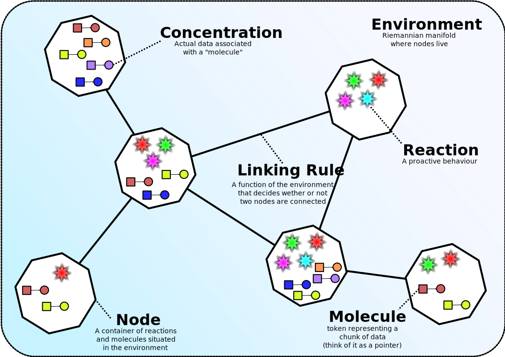
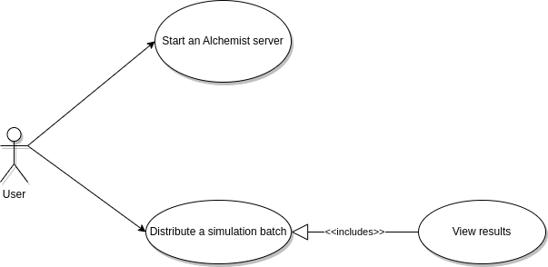
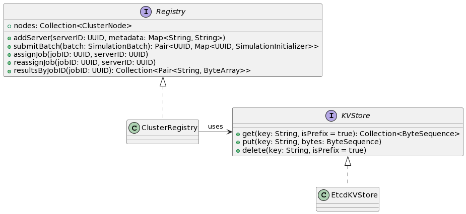
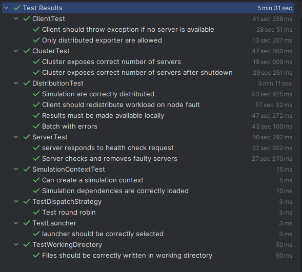

<style>

</style>

# Alchemist simulation batches distribution

## Abstract
Alchemist[^alchemist] is an open-source and general-purpose simulator developed in
the University of Bologna. Simulation can be executed by writing their configurations in YAML. Sometimes it may be useful to execute the same configuration with different parameters, called variables. The set of simulation
differing by their variables constitute a batch. Alchemist provides a way to
launch a simulation batch sequentially. The aim of this project is to implement in Alchemist a batch distribution mechanism in order to parallelize
batch simulations computation and reduce the time spent in executing the
batch.

## Analysis

### Alchemist's meta-model

<p align=center>
  
</p>

The main element's that compose the Alchemist meta-model are:

* **Molecule**: the name that is associated with a data item. 
* **Concentration**: the value associated to a particular *molecule*.
* **Node**: a container of *molecules* and *reaction* that lives inside an *environment*.
* **Environment**: a space abstraction. It contains nodes, and it is able to tell where nodes are (their position), 
distance between two nodes and optionally gives support for moving nodes within the environment.
* **Linking rule**: a function based on the current state of the environment that associate to each node a *neighborhood*.
* **Neighborhood**: entity composed of a node (center) and a set of nodes (neighbors).
* **Reaction**: any event that can change the status of the *environment*. It is defined by a possibly empty set of *conditions*, one or more actions and a *Time distribution*. Together with a *static rate* parameter, the value of each condition, a *rate equation* giving back an *instantaneous rate* by combining the static rate and the value of conditions, the *time distribution* determines the frequency at which the reaction will happen.
* **Condition**: a function that outputs a boolean and a number based on the current state of the *environment*
* **Action**: models a change in the environment.

#### Incarnations

The meta-model is instantiated by one of the available incarnations that are:

* **Protelis**
* **SAPERE**
* **Biochemistry**
* **Scafi**

An incarnation of Alchemist includes a type definition of concentration, and possibly a set of specific conditions, actions and (rarely) environments and reactions that operate on such types. More information could be found on the Alchemist official website.

### Requirements analysis

The Alchemist simulator already provide means for writing simulation configurations meant to be run locally. It also provides modes for executing batch of simulation. A simulation batch is a set of simulations, each differing by one or more variables. This enables to test or execute the same configuration with different parameters. Running a simulation can be time-consuming, let alone running a simulation batch. Taking advantage of multiple computing resource can be a way to reduce the time necessary to complete a simulation batch. The following functional requirement has been identified:

* It should be possible to create a cluster of nodes, each executing a service exposing
Alchemist.
* Alchemist should provide a way to distribute a batch of simulations to be executed
by one or more nodes on a cluster.
* Each node of a cluster must be up and ready to receive and execute configurations
of simulations.
* None of the distributed simulations should get lost, meaning that in case of a node
failure, a recovery mechanism should redistribute the simulations assigned to the
failing node.
* Once a simulation is computed by a node, results should be made available to the
user who launched the distribution.

### Q/A

- Q: ***How will a new node connect to a cluster?***  
  A: The node should automatically discover and join other nodes in the network (service discovery)

- Q: ***Currently existing exporters either produce files or write to an external database, how will it be in case of distribution?***  
  A: Nothing should change in the case of exporting to an external database. In case of file exports, the files should be delivered back to the workstation that launched the node.

- Q: ***What about the heterogeneity of the nodes in a cluster, how will the distribution strategy be affected?***  
  A: As a first step, heterogeneity should not be considered, all nodes should be seen as equally capable. In the future load balancing should be made based on the computation complexity in terms of *CPU and memory usage*.

- Q: ***What happens in case of a network partition between the client and the servers?***  
  A: Simulation running on the server should continue running, and save the result somewhere, for future retrieval.

### Scenarios

There are two main kinds of scenarios:

* A user launches Alchemist in *server mode*, adding itself to an existing cluster, or creating a new one.

* A user lunches Alchemist to distribute a batch of simulation across nodes in a cluster.

<p align=center>
  
</p>

### Self assessment policy

Assessment will be made by means of automatic tests. Testing should cover at least the requirements reported in the analysis.

## Design

### Architecture

<p align=center>
  
</p>

As reported in the picture above, from a macro-perspective system architecture follows a client-server style. However, communication between client and servers is node direct but is made via message exchange. Thus, the need of Message broker, responsible for message delivery.
For what concerns the management of all the information that guarantees the correct functioning of the system a cluster registry has been devised. The registry will hold information like what job have been assigned to what server, and store the job results and so on.  

### Structure

In the following the main entities composing the domain model will be described.

<p align=center>
  
</p>

* **Cluster** is an entity representing the collection of nodes that are currently connected forming a cluster. Through the cluster it is possible to obtain a `Dispatcher`, specifying the complexity that the nodes in the dispatcher should be able to handle. 

* **ClusterNode** represent a server node to which jobs can be distributed.

* **Dispatcher** contains a subset of the nodes in the cluster. It is responsible for accepting `SimulationBatches` and distribute them across subset of nodes. Distribution is made according to a `DispatchStrategy`

* **DispatchStrategy** it models the strategy with which the work load gets distributed to a collection of nodes (e.g. *round-robin*).

* **Complexity** describes the complexity in terms of ram usage and memory occupation for the simulations in a batch.

* **SimulationBatch** represents a simulation batch with its complexity. It is composed of a simulation configuration and a collection of simulation initializers.

* **SimulationConfig** contains the general batch information such as the end step and end time of the simulations and a loader from which simulation instances will be created. `Dependencies` are files that must be made available to all servers in order to execute the simulation correctly.

* **SimulationInitializer** contains a combination of variables values that will be used to create a simulation instance. For every simulation initializer in a simulation batch corresponds a job for a node in the cluster.

* **BatchResult** models the result of a simulation batch that have been submitted via a `Dispatcher`. It gives information on the total number of errors, if any, that have occurred while executing the simulation batch and a utility method to save all the distributed export files locally. 

* **SimulationResult** models the result of a single job. 

### Behavior

#### Alchemist - server side

<p align=center>
  
</p>

When Alchemist is launched in server mode, the server will initially be in an *IDLE* state. In this state the server will be detecting any cluster node fault. It will also wait for job orders to execute. Once a job order is received, it will be scheduled and executed as soon as possible, transitioning to a *RUNNING* state. When all jobs have been executed the server will return to the *IDLE* state, and so on.

#### Alchemist - client side

<p align=center>
  
</p>

From the client side, when Alchemist is launched to distribute a simulation batch, first, the client will be building the various simulation derived from the cartesian product of the values of the specified variables. When all simulation have been built, they will be distributed to the various cluster nodes. Client will then be in a *WAITING* state. While the client is waiting it will also run a fault detection routine. In case a fault is detected, jobs dispatched to the faulty server are redistributed across the remaining cluster nodes. When and if no more nodes are available the user is notified of the error.

### Interactions

In this section two of the most important interaction will be described.

#### Fault detection

<p align=center>
  
</p>

To be able to respond to nodes failure, every node in the cluster checks for the liveness of other nodes with a simple fault detection routine.
When a server, *AS01*, wants to check whether another server, *AS02*, is still running, it will send a *health check request* message to that server. Server AS02 will be considered alive if it responds withing a timeout period. Otherwise, if a timeout expires and AS02 have not yet responded, the server will be considered faulty and be removed from the registry (Actually AS01 may send multiple health check requests and decide that after a number of missing replies AS02 is dead).

#### Batch distribution

<p align=center>
  
</p>

As for the distribution of a simulation batch, a user must launch the client that will firstly build all the simulation. When the building is done, the client submits the simulations to the registry. After that it will send one or multiple job orders to the servers that were selected by the *dispatch strategy*. 
When a server receives a job order, it will retrieve the simulation instance from the registry, run it and, in no errors is encountered, submit the results back to the registry. After results submission, the server will notify the client that the job had been executed and completed. At this point the client can get the results from the registry and make them available to the user. 


## Implementation

### Technologies

#### Etcd

Etcd[^etcd] is a distributed, reliable and strongly consistent key-value store. It has been used to store the most important data for the functioning of the system (The registry). In theory, if all nodes in the cluster crashes, just by using the information stored in the registry it could be possible to resume any job that was executing before failure. Thus, it is the most important technology that had been used in the project.

<p align=center>
  
</p>

#### RabbitMQ

RabbitMQ[^rabbitmq] is an open-source message broker based on the Advanced
Message Queuing Protocol (AMQP) for reliable communication. Among all, it supports point-to-point and publish/subscribe message patterns.

<p align=center>
  
</p>

The pattern chosen for this project is the *point-to-point*. In particular, every server declares and listens in two message queues: one for receiving job orders and another to receive health check requests.

#### Protocol Buffers

Protocol Buffers[^protobuf] are a language-neutral, platform-neutral extensible mechanism for serializing structured data. Once the structure of the data has been defined it is possible to use special generated source code to easily write and read your structured data to and from a variety of data streams and using a variety of languages.

It has been used in this project for the serialization and de-serialization of data for persistence in the registry and for message exchange.

## Self-assessment

<p align=center>
  
</p>

A series of test have been written to assess whether the system complies with the project requirements. One of the main challenges, as with every distributed system in general, was dealing with asynchronous behavior and non-determinism. Fortunately the testing framework that was used (Kotest) provides a nice and idiomatic way to deal with these issues. For example to test that within a certain amount of time a node should connect to the cluster we could write:


```kotlin
eventually(5.seconds) {
    cluster.nodes shouldHaveSize 1
}
```

 or to be sure that the condition is verified before going on:

```kotlin
until(5.seconds) {
    cluster.nodes.size == 1
}
```

Aspects that have been test are related to the client and server, by themselves, and to the interaction between them.

## Deployment

> **Useful preliminary readings:**
> - [Parameter sweeping with simulation batches](https://alchemistsimulator.github.io/howtos/execution/batch/index.html)
> - [Define the termination criteria](https://alchemistsimulator.github.io/howtos/execution/termination/index.html)
> - [Export data](https://alchemistsimulator.github.io/howtos/simulation/export/index.html)
> - [Command line interface](https://alchemistsimulator.github.io/reference/cli/index.html)

For the correct functioning of the system, first, the RabbitMQ message broker and the etcd cluster should be deployed. The following docker compose file does the job:

```yml
version: '3.9'
name: "alchemist-grid"
services:
  node_1:
    image: bitnami/etcd
    ports:
      - 10000:2379
    volumes:
      - node_1_volume:/etcd_data
    environment:
      ETCD_NAME: node_1
      ETCD_DATA_DIR: node_1
      ETCD_ADVERTISE_CLIENT_URLS: http://node_1:2379
      ETCD_LISTEN_CLIENT_URLS: http://0.0.0.0:2379
      ETCD_INITIAL_ADVERTISE_PEER_URLS: http://node_1:2380
      ETCD_LISTEN_PEER_URLS: http://0.0.0.0:2380
      ETCD_INITIAL_CLUSTER: node_1=http://node_1:2380,node_2=http://node_2:2380,node_3=http://node_3:2380
      ALLOW_NONE_AUTHENTICATION: 'yes'
      ETCD_INITIAL_CLUSTER_STATE: new
      ETCD_MAX_REQUEST_BYTES: 268435456

  node_2:
    image: bitnami/etcd
    ports:
      - 10001:2379
    volumes:
      - node_2_volume:/etcd_data
    environment:
      ETCD_NAME: node_2
      ETCD_DATA_DIR: node_2
      ETCD_ADVERTISE_CLIENT_URLS: http://node_2:2379
      ETCD_LISTEN_CLIENT_URLS: http://0.0.0.0:2379
      ETCD_INITIAL_ADVERTISE_PEER_URLS: http://node_2:2380
      ETCD_LISTEN_PEER_URLS: http://0.0.0.0:2380
      ETCD_INITIAL_CLUSTER: node_1=http://node_1:2380,node_2=http://node_2:2380,node_3=http://node_3:2380
      ALLOW_NONE_AUTHENTICATION: 'yes'
      ETCD_INITIAL_CLUSTER_STATE: new
      ETCD_MAX_REQUEST_BYTES: 268435456
  node_3:
    image: bitnami/etcd
    ports:
      - 10002:2379
    volumes:
      - node_3_volume:/etcd_data
    environment:
      ETCD_NAME: node_3
      ETCD_DATA_DIR: node_3
      ETCD_ADVERTISE_CLIENT_URLS: http://node_3:2379
      ETCD_LISTEN_CLIENT_URLS: http://0.0.0.0:2379
      ETCD_INITIAL_ADVERTISE_PEER_URLS: http://node_3:2380
      ETCD_LISTEN_PEER_URLS: http://0.0.0.0:2380
      ETCD_INITIAL_CLUSTER: node_1=http://node_1:2380,node_2=http://node_2:2380,node_3=http://node_3:2380
      ALLOW_NONE_AUTHENTICATION: 'yes'
      ETCD_INITIAL_CLUSTER_STATE: new
      ETCD_MAX_REQUEST_BYTES: 268435456
  rabbitmq-service:
    image: rabbitmq:3-management
    restart: always
    ports:
      - "5672:5672"
      - "8080:15672"
    healthcheck:
      test: rabbitmq-diagnostics -q status
      interval: 10s
      timeout: 10s
      retries: 5
volumes:
  node_1_volume:
  node_2_volume:
  node_3_volume:
```

After that it is possible to launch one or more Alchemist Server. To do that we must right a configuration file telling the server how to connect to the message broker and to the etcd cluster. Here's an example based on the above docker compose file:

```yaml
etcd:
  endpoints: ["http://localhost:10001", "http://localhost:10002", "http://localhost:10003"]
rabbitmq:
  username: "guest" # or ALCHEMIST_RABBITMQ_USERNAME=guest env variable
  password: "guest" # or ALCHEMIST_RABBITMQ_PASSWORD=guest env variable
  host: "localhost" # or ALCHEMIST_RABBITMQ_HOST=localhost env variable
  port: 5672 # or ALCHEMIST_RABBITMQ_PORT=5672 env variable
```

We must then write an alchemist configuration file that launches the server:

```yaml
incarnation: protelis
launcher:
  type: ServerLauncher
  parameters: ["distribution-config.yml"]
```

Here in particular we are instructing the Alchemist's loading system to launch an instance of `ServerLauncher` by passing to it the path of the distribution configuration that we wrote earlier.

Finally, we can use the alchemist jar file to launch the server, by running the following command, specifying the configuration file.

```bash
java -jar alchemist.jar run server-config.yml 
```
> Note: to obtain the alchemist jar we must run the `shadowJar` gradle task from the project [code base](https://github.com/kelvin-olaiya/Alchemist/tree/chore/exam-distributed-systems)
> ``` bash
> ./gradlew alchemist-full:shadowJar
>```
> 
>Once the task completes, the jar file can be found under *build/shadow/*
> named something like **alchemist-full-VERSION-TAG-all.jar**

Once we've launched our desired number of server we can then launch the client. This means writing a simulation configuration and specifying that we are interested in launching a distributed execution.

```yaml
incarnation: sapere

# ... simulation configuration ...

launcher:
  type: DistributedExecution
  parameters: ["distribution-config.yml", ["list", "of", "variables", "..."], "./export-path/"]
```

The *DistributedExecution* launcher required parameters are:

* The distribution configuration file: the same provided to various server, to enable the connection to the etcd cluster and to the message broker.

* A list of variables from with the various simulation will be created, by computing the cartesian product of the values those variable can assume.

* An export path: This will be the location in which eventual file will be saved.

The command to run for launching the client is

```bash
java -jar alchemist.jar run client-config.yml
```

### Usage example

A distribution example is available in [this repo](https://github.com/kelvin-olaiya/exam-ds-demo). In the example reported below, a diffusion program is exemplified: when a `token` is present locally, it is copied into neighboring nodes once per second; and as soon as two copies of `token` are present, one gets removed.

```yaml
incarnation: sapere

variables:
  verticalEnd: &verticalEnd
    type: LinearVariable
    parameters: [5, 5, 6, 1]
  horizontalEnd: &horizontalEnd
    type: LinearVariable
    parameters: [5, 5, 6, 1]

network-model:
  type: ConnectWithinDistance
  parameters: [0.5]

deployments:
  type: Grid
  parameters: [-5, -5, *horizontalEnd, *verticalEnd, 0.25, 0.25, 0.1, 0.1]
  contents:
    - in:
        type: Rectangle
        parameters: [-0.5, -0.5, 1, 1]
      molecule: token
  programs:
    -
      - time-distribution: 1
        program: >
          {token} --> {firing}
      - program: "{firing} --> +{token}"
export:
  - type: DistributedCSVExporter
    parameters: ["time_export", 1.5]
    data:
      - time

terminate:
  - type: AfterTime
    parameters: 6000

launcher:
  type: DistributedExecution
  parameters: ["distribution-config.yml", [verticalEnd, horizontalEnd], "./export"]
```

Nodes are placed in a grid whose size is parameterized in its *vertical* and *horizontal* end. Exporting will be made to CSV files using a `DistributedCSVExporter`. The export data is very trivial for sake of simplicity, it just reports time samples.

## Conclusions

### Future works

One of the possible future works could be the creation of a monitoring dashboard from which it would be possible to see which job have been dispatched to which server, view the status of the submitted simulation, obtain the results (this means with the opportunity of recovering from a possible client-side network partition), and also pause stop or reschedule the submitted simulation. 
Of course, also improvement to my proposed solution could be made, for example on the fault detection routine that requires a lot of messages travelling on the network, which is not ideal when there are many nodes in a cluster. 

### What I've learned

This project has been a bit challenging, even though it was not the first time for me working on an existing project rather than from scratch, I recognize the effort of sacrificing the potential of a novel design to adhere and adapt to a preexisting infrastructure and design. 

Regarding distribution aspect, I've learned that communication between distributed computing resource can be non-trivial if not designed from the beginning (I'm mostly referring to the marshalling and unmarshalling of data and information). 
In the end I've learned that a good first solution doesn't have to be necessarily complex to be functional, and there will always be space for improvements, always.
## Reference
[^alchemist]: https://alchemistsimulator.github.io
[^protobuf]: https://protobuf.dev/
[^etcd]: https://etcd.io
[^rabbitmq]: https://www.rabbitmq.com/